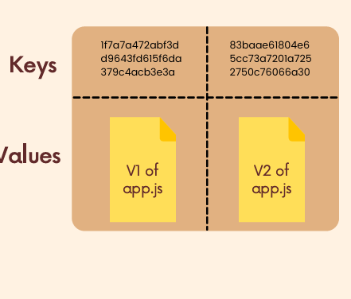
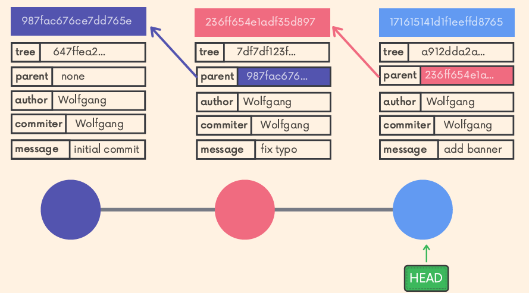
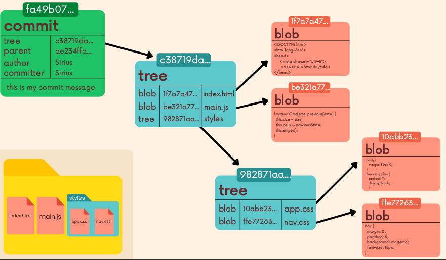

# what is .git folder ?

it is folder which git create when we initialize any project to track by th command `git init`. git use this folder to store all the commits, tags, blobs, tree , heads, branch any many other things to keep track our changes in files.

## what is inside .git/

there are files and directory like

- HEAD
- refs/
- objects/
- hooks/
- info/
- logs/
- index
- config

1. Config
   it is file for customization of repo like color, alias , remote etc.

```
# color customization
[user]
  name=some name
  email=some email
[color]
  ui=true
[color "branch"]
  local= cyan bold
  current= magenta
[color "diff"]
  old=add some color
  new=add another color

```

2. refs/
   it is directory that store pointer of heads , tags, remotes ..
   inside heads/ there are reference for latest commit-hash for branch like master, bugFix, darkMode, many other branches.

3.objects/
The objects directory contains all the repo
files. This is where Git stores the backups of
files, the commits in a repo, and more.
The files are all compressed and encrypted,
so they won't look like much

## 4- types GIT objects

- commit
- blobs
- tree
- anotated tags

## Hashing function:

the function which map the inputs of arbitrary size into some fixed size output.

### Cryptographic Hashing :

1. One-way function which is infeasible to invert
2. Small change in input yields large change in the output
3. Deterministic - same input yields same output
4. Unlikely to find 2 outputs with same value

**Note**: git use SHA-1 algorithm for hashing function which gives 40 characters hexadecimal number which is commit-hash, blobs-hash etc

# Git database

Git is a key-value data store. We can insert
any kind of content into a Git repository, and
Git will hand us back a unique key we can
later use to retrieve that content.

These keys that we get back are SHA-1
checksums


## blobs

Git blobs (binary large object) are the object
type Git uses to store the contents of files in a
given repository. Blobs don't even include the
filenames of each file or any other data. They
just store the contents of a file

## Trees

Trees are Git objects used to store the
contents of a directory. Each tree contains
pointers that can refer to blobs and to other
trees.  
Each entry in a tree contains the SHA-1 hash
of a blob or tree, as well as the mode, type,
and filename.

### some commands

- viewing trees :
  git cat-file -p master^{tree}
- git cat-file -t <object-hash> : tell about type of object like commit, blob, tree

## Commits



Commit objects combine a tree object along
with information about the context that led to
the current tree. Commits store a reference
to parent commit(s), the author, the committer,
and of course the commit message!

- every commit got reference to previous commit in parent:<commit-hash>
- we can see by using `git cat-file -p <commit-hash>`



some terms like:

- tree : structure of project while committing the project .
- blob : content store in file is blob.
- author:
- committer:
- message

everything is stored as hashed in objects directory so that git can retrieve data by the hashed key which is output of SHA-1 hashing function

## Resources

- [image link](https://app.eraser.io/workspace/2tdTy9Hd2uQwgkLZNXW4?elements=xvsxkM58L4k_TVwJfGsyIg)
