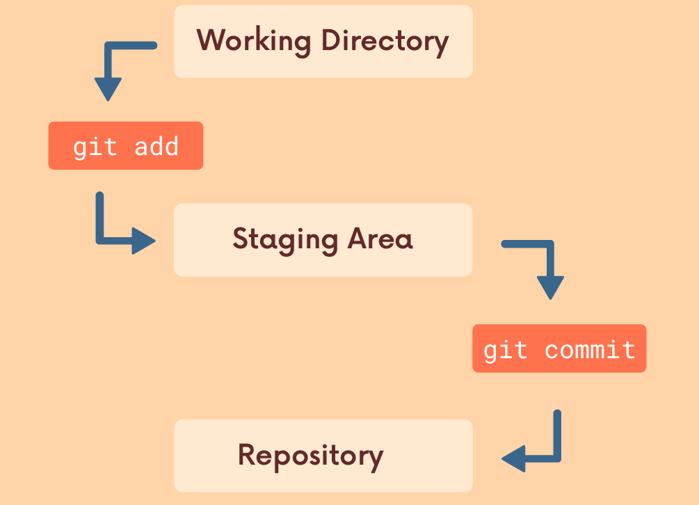

# What is GIT ?

Git is very popular and widely used over many like preforce, mercurial , subversion etc
git is Distributed Version Control System (DVCS) meaning:

- Version Control: keep track of every changes in files over time.
- Distributed : unlike older system, every developer has full copy of project history on their own machine, not just on the central server.

and also it helps to collaborate with different developers . it manages the history of code and helps to merge the code from different branch.

# A Little bit on VCS :

- it manages the history of code .
- helps to tracks the changes and collaborate with each other.
- it is like the checkpoint in game.
- developer can alway comeback to the previous checkpoint (commit ) in history of commits.

- git is software install on your machine and start to work in projects
- `git --version` : to check which version is install on your computer

# Some Terminology in GIT

let's learn about some Vocab:

- Repository (Repo) : it is "container" of "folder" in which entire projects and history of commits live.
- Branch : It is alternate timeline of your repository . it allows to work in to features in isolation.
- commit: A snapshot of your changes of files at specific point of time.like "saved point" in game.
- Head : it is pointer which shows the current branch or commit currently you are looking at.

# Git "3-stage workflow"

1. Working Directory: currently working / writing code file(Modified File).
2. Staging area(Index): it is waiting room in which you pick which changes you want to include in next snapshots(commit).
3. Repository(local):where Git permanently store the snapshots(commit)

# Essential GIT Commands

Here are the "Big Five" commands you will use 90% of the time:

| Command               | What it does                                                            |
| --------------------- | ----------------------------------------------------------------------- |
| `git init`            | Initializes a brand new Git repository in your current folder.          |
| `git status`          | Shows you which files are modified, staged, or untracked.               |
| `git add <file>`      | Moves changes from the Working Directory to the Staging Area.           |
| `git commit -m "msg"` | Saves your staged changes to the Repository with a descriptive message. |
| `git log`             | Displays the history of all commits made in the project.                |

# Git diff

`git diff` is used to compare between two commits. it shows the difference between the changes of two files.

### How to read diff output

- a/ :original file before changes.
- b/ :updated file after change.
- --- : marks the beginning of original file
- +++ : marks the beginning of updated file
- @@ : shows the line number and position of changes

### comparing between working directory and staging area: `git diff`

### comparing between staging area and last commits: `git diff --staged`

### comparing between two branches: `git diff <branch-one> <branch-two>`

### comparing between two commits: `git diff <commit-hash-one> <commit-hash-two>`

**git revert <commit-hash>**: to revert the changes in the commit means remove the insertion and add the deletion in new commit.
**git reset --hard <commit-hash>**: to reset the HEAD to specific commit

# Git CheatSheet

| Command                       | Description                                 |
| ----------------------------- | ------------------------------------------- |
| `git init`                    | Initialize a new Git repository             |
| `git clone <url>`             | Clone a repository from a URL               |
| `git status`                  | Show the status of the working directory    |
| `git add <file>`              | Stage a file for commit                     |
| `git add .`                   | Stage all changes in the current directory  |
| `git commit -m "message"`     | Commit staged changes with a message        |
| `git push`                    | Push commits to a remote repository         |
| `git pull`                    | Fetch and merge changes from a remote repo  |
| `git branch`                  | List branches                               |
| `git branch <name>`           | Create a new branch                         |
| `git checkout <branch>`       | Switch to a specific branch                 |
| `git merge <branch>`          | Merge a branch into the current branch      |
| `git log`                     | View commit history                         |
| `git diff`                    | Show differences between working files      |
| `git reset <file>`            | Unstage a file                              |
| `git stash`                   | Save changes without committing             |
| `git stash pop`               | Reapply stashed changes                     |
| `git fetch`                   | Download objects and refs from another repo |
| `git remote add <name> <url>` | Add a remote repository                     |
| `git rebase <branch>`         | Reapply commits on top of another branch    |

# The basic GIT Workflow


## The most used commands every day using git

- git status:it gives information on the current status of git repo and it's content. it must be first command to check whether **you are in git repo or not** and before add and commit you want to see what are files which are untracked, add or staged. These all Info is given by `git status`
  if you try on first then it say **fatal: not a git repository
  (or any of the parent directories)**

our actual first command is git init

- `git init`: it is used to create new git repository.This is something you do once per projects. Initialize on top folder containing your projects
  **git tracks all directory and nested sub directories**

  

- git add <file-name> : it add files for next commits (called staging area).for multiple files to add used `git add file1 file2`
- git add . :stage all changes at once

## committing

it is most important part where git looks into staging area nad store permanently into repository

- git commit -m"add some file"
- git commit -a -m "bug fix in main" : it is single command to stage and commit .
  **Note**: **always check status of file to add and commit, `git status`is your friend**

# Branching

- it is essential part of git.
- it is like alternate timeline of project.
- it enables us to create new context where we can try new things, works in multiple ideas in parallel
- it does not effect into main branch unless we merge it .
  [branching link](https://app.eraser.io/workspace/2tdTy9Hd2uQwgkLZNXW4?elements=Lds8VphqwwFjcDv3eGHNJg)

**You probably have seen , On master branch , nothing to commit**

## Master branch

in git you always work in branch, default branch named "master"

Info: In 2020 , github renamed default branch from master to main

common workflow like, working on master -> ->merge it
-> experimental branch

## what is master<-HEAD

it is pointer pointed to current location in your repository. it stores current branch references. it changes when branch change , means we can change HEAD position.
[Head figure](https://app.eraser.io/workspace/2tdTy9Hd2uQwgkLZNXW4?elements=8x15cVQ8IXHXWMNE_mBT5Q)

HEAD toggle between branches . when we make another branch darkMode then it point to darkMode. write some codes and commit then it point to latest commit . we can switch to master then HEAD point to latest commit of master . when we merge darkMode to master then it point to merge commit in master branch .

- `git branch` : show lists of all branches

## create branch

- `git branch <branch-name>`

## switch between branch

- `git switch <branch-name>`

## create branch and switch in one go

- `git branch -c <branch-name>`

## old command to create and switch branch

- `git checkout <branch-name>`: switch branch
- `git checkout -b <branch-name>`: create and witch branch (old command) but still used.

## delete and rename branch

-`git branch -d <branch-name>` : delete branch

- `git branch -D <branch-name>` : delete with --force means it deleted even if any error of merge shows.

- `git branch -m <new-branch-name>`: rename branch
  Note : we have to switch in other branch beside branch to be deleted but for rename we have to switch into branch that need to rename

- `git branch -v `: view more info of branch

# Merging

Branching makes easy to work in self contained context but often we need to incorporate one branch into another which is merging branch

## merging in simple way

suppose we work in bugFix branch and it's okay and we need to merge it into master then two steps to followed:

- git switch master
- git merge bugFix

## 3 merges

- Fast-Forward
- merge with message(no-conflict)
- merge with conflict(resolve first then merge)

1. [fast-forward-merge](https://app.eraser.io/workspace/2tdTy9Hd2uQwgkLZNXW4?elements=rmF7RqxTtNdW-yGWH20Liw)

Not all merges are fast-forward merge
this happens all time, suppose one of our teammate merge new feature or change master while working on branch.
[not-fast-forward](https://app.eraser.io/workspace/2tdTy9Hd2uQwgkLZNXW4?elements=-K2lvhdRr-iKRMGhuuExig)

when we try to merge then git performs "merge commit" and open our default code editor to write merge commit message.

2. merge with commits message: [figure-reference](https://app.eraser.io/workspace/2tdTy9Hd2uQwgkLZNXW4?elements=XzPXc17MKZuYJQHWgm5axg)

Depending upon the specific changes you are trying to merge . git can not automatically merge . if conflict arise you have to manually resolve and then commit.
suppose the same file you edit in master branch and same file you change into features branch then when you try to merge then git shows conflict error like this :

```
CONFLICT (content): Merge conflict in blah.txt
Automatic merge failed; fix conflicts and then commit the result.

```

```
<<<<<<< HEAD
I have 2 cats
I also have chickens
=======
I used to have a dog :(
>>>>>>> bug-fix
```

## Conflict markers

The content from your current HEAD (the branch you
are trying to merge content into) is displayed
between the <<<<<<< HEAD and ======

and The content from the branch you are trying to merge
from is displayed between the ======= and

> > > > > > > symbol.
> > > > > > > then you have to manually resolve conflict and add and commit to the branch

# GIT DIFF

it is informative command which show difference between two branch, commits, staged and unstaged changes of files

- git diff :compare between latest commit and all unstaged changes
- git diff HEAD : show all changes between latest HEAD and staged or unstaged files
- git diff --staged : show all staged changes from last commit.
- git diff branch1..branch2 : show the changes between two branch
- git diff commit1..commit2 : show the changes of two commits

## narrowing diff

- git diff HEAD [filename]
- git diff --staged [filename]

# GIT Stash

it is command that store the working directory and staging area before switching branch without commit. when we try to switch branch without commit , git do 2 things:1. bring that changes into detination branch 2. show error and tell to commit first . so in that situation `git stash ` is useful

- git stash : save all the unstaged and staged changes
- git stash pop: pop the stash
- git stash apply : it apply stash but donot remove the stash .

## working with multiple stash

- git stash list : show list of stash.
- git stash apply <stash -id> : apply stash of particular id.
- git stash drop <stash-id>: drop the particular stash
- git stash clear : clear list of stash

# Undoing Stuff and Time Travelling

## Detached HEAD

usually HEAD points to specific branch which has reference of its latest commit . but we can move back to any commit by using `git checkout <commit-hash>`.and we can edit , create branch do many things. and again for attach HEAD , we use `git switch <branch-name>` or `git switch -`

- git checkout HEAD~1 : 1 commit back from HEAD
- git checkout HEAD~2: 2 commit back from HEAD

# Discarding Changes

suppose you add various changes in file and you donot want to keep it and you want to discard change and want last commit changes

- git checkout HEAD <filename>
- git checkout -- <filename>

there is new command to do this works:

- git restore <filename>
- git restore --source HEAD~1 <filename> : restore the content

# unstage the staging area

- git restore --staged <filename>

# reset

- git reset <commit-hash> : it reset head and keep changes in working directory
- git reset --hard <commit-hash>: it reset head and donot keep changes / delete commit

# revert

- git revert <commit-hash>: it revert the changes but create new commit

# Both git reset and git revert reverse the changes , which one should use?

Both git reset and git revert help us reverse changes, but there is
a significant difference when it comes to collaboration.

If you want to reverse some commits that other people already
have on their machines, you should use revert.

If you want to reverse commits that you haven't shared with
others, use reset and no one will ever know!

# Resources

[Blog-link](https://dipeshchaudhary.hashnode.dev/all-about-git-and-its-commands)
