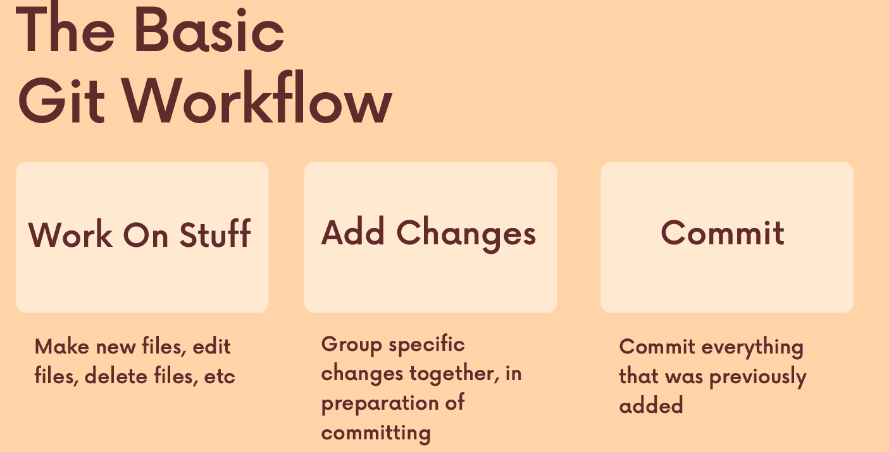

# What is GIT ?

Git is very poular and widely used over many like preforce, mercurial , subversion etc
git is Distributed Version Control System (DVCS) meaning:

- Version Control: keep track of every changes in files over time.
- Distributed : unlike older system, every developer has full copy of project history on their own machine, not just on the central server.

and also it helps to collaborate with different developers . it manages the history of code and helps to merge the code from different branch.

# A Little bit on VCS :

- it manages the history of code .
- helps to tracks the changes and collaborate with each other.
- it is like the checkpoint in game.
- developer can alway comeback to the previous checkpoint (commit ) in history of commits.

- git is software install on your machine and start to work in projects
- `git --version` : to check which version is install on your computer

# Some Terminology in GIT

let's learn about some Vocab:

- Repository (Repo) : it is "container" of "folder" in which entire projects and history of commits live.
- Branch : It is alternate timeline of your repository . it allows to work in to features in isolation.
- commit: A snapshot of your changes of files at specific point of time.like "saved point" in game.
- Head : it is pointer which shows the current branch or commit currently you are looking at.

# Git "3-stage workflow"

1. Working Directory: currently working / writing code file(Modified File).
2. Staging area(Index): it is waiting room in which you pick which changes you want to include in next snapshots(commit).
3. Repository(local):where Git permanently store the snapshots(commit)

# Essential GIT Commands

Here are the "Big Five" commands you will use 90% of the time:

| Command               | What it does                                                            |
| --------------------- | ----------------------------------------------------------------------- |
| `git init`            | Initializes a brand new Git repository in your current folder.          |
| `git status`          | Shows you which files are modified, staged, or untracked.               |
| `git add <file>`      | Moves changes from the Working Directory to the Staging Area.           |
| `git commit -m "msg"` | Saves your staged changes to the Repository with a descriptive message. |
| `git log`             | Displays the history of all commits made in the project.                |

# Git diff

`git diff` is used to compare between two commits. it shows the difference between the changes of two files.

### How to read diff output

- a/ :original file before changes.
- b/ :updated file after change.
- --- : marks the beginning of original file
- +++ : marks the beginning of updated file
- @@ : shows the line number and position of changes

### comparing between working directory and staging area: `git diff`

### comparing between staging area and last commits: `git diff --staged`

### comparing between two branches: `git diff <branch-one> <branch-two>`

### comparing between two commits: `git diff <commit-hash-one> <commit-hash-two>`

**git revert <commit-hash>**: to revert the changes in the commit means remove the insertion and add the deletion in new commit.
**git reset --hard <commit-hash>**: to reset the HEAD to specific commit

# Git CheatSheet

| Command                       | Description                                 |
| ----------------------------- | ------------------------------------------- |
| `git init`                    | Initialize a new Git repository             |
| `git clone <url>`             | Clone a repository from a URL               |
| `git status`                  | Show the status of the working directory    |
| `git add <file>`              | Stage a file for commit                     |
| `git add .`                   | Stage all changes in the current directory  |
| `git commit -m "message"`     | Commit staged changes with a message        |
| `git push`                    | Push commits to a remote repository         |
| `git pull`                    | Fetch and merge changes from a remote repo  |
| `git branch`                  | List branches                               |
| `git branch <name>`           | Create a new branch                         |
| `git checkout <branch>`       | Switch to a specific branch                 |
| `git merge <branch>`          | Merge a branch into the current branch      |
| `git log`                     | View commit history                         |
| `git diff`                    | Show differences between working files      |
| `git reset <file>`            | Unstage a file                              |
| `git stash`                   | Save changes without committing             |
| `git stash pop`               | Reapply stashed changes                     |
| `git fetch`                   | Download objects and refs from another repo |
| `git remote add <name> <url>` | Add a remote repository                     |
| `git rebase <branch>`         | Reapply commits on top of another branch    |

# The basic GIT Workflow

