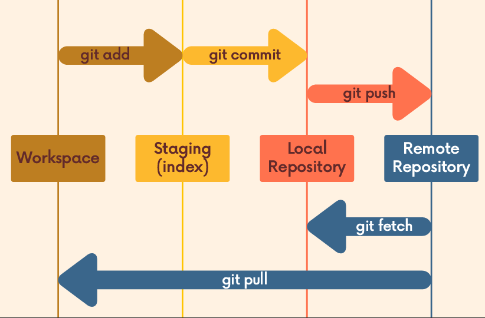

# Resources

- [blog link](https://dipeshchaudhary.hashnode.dev/dive-into-github)

# What is Github

it is hosted platform for git repository.

## Uses:

- to push code in cloud.
- it enables collaboration with other developers.
- Open Source Projects
- we can access code from anywhere anytime

# Cloning

it is important step to bring the source code and it's all commit history, we need to clone the projects so that we can work in our machine

- `git clone <url>`: clone the project

# Setup remote

remote is simply provide name to remote url in which our code pushed .

## some commands

- git remote : to check remote in our repo
- git remote -v: to get remote with url
- git remote add <remote> <url> : to set remote to our repo.
- git remote rename <old> <new>: to rename remote
- git remote remove <name> : to remove remote.

# pushing

it is used to push our local repo (machine) to remote repo(github).

- git push <remote> <branch> : to push into remote (github)

## -u

to set upstream our local branch to remote branch so that from next time we do not need to write again same `git push origin main` : suppose we push into main branch with origin remote name

- git push -u <remote> <branch> : to set upstream of our local branch to remote branch.

# Remote Tracking Branch

- it is like bookmark of when our last commit push into github.
- it tells your local branch is ahead or behind whish is in github by help of (RTB).
- it looks like origin/main <remote>/<branch>

## To see Remote Tracking Branch

- git branch -r: show list of RTB.
  the RTB do not move when we push commits in our local machine . it only updated when we push to github .it helps to fetch and pull the code .

# Fetching and Pulling

## GIT FETCH

The git fetch <remote> command fetches branches and
history from a specific remote repository. It only updates
remote tracking branches.
git fetch origin would fetch all changes from the origin
remote repository.

- which we can see the changes by using `git checkout <remote-tracking-branch>` like git checkout origin/navbar
- the changes does not integrate into the working directory.

## GIT PULL

git pull is another command we can use to retrieve
changes from a remote repository. Unlike fetch, pull
actually updates our HEAD branch with whatever
changes are retrieved from the remote.
"go and download data from Github AND immediately
update my local repo with those changes

- git pull <remote> <branch>
  it is like git pull = git fetch + git merge
  so there might be conflict so we have to resolve manually and commit changes and then push to github

so the workflows be like :

- git switch -c navbar
- write some code.
- before push in github first check is there any changes in code in github or not by git pull
- then push into github

# Difference between fetch and pull

## git fetch

- Gets changes from remote branch(es)
- Updates the remote-tracking branches
  with the new changes
- Does not merge changes onto your
  current HEAD branch
- Safe to do at anytime

## git pull

- Gets changes from remote branch(es)
- Updates the current branch with the
  new changes, merging them in
- Can result in merge conflicts
- Not recommended if you have
  uncommitted changes

# Rebasing vs Merging

## Rebasing

There are two main ways to
use the git rebase command:

- as an alternative to merging
- as a cleanup too

I work on collaborative project. I work on features branch . I do 2 commits in master branch . and my team-mate does some commit in master branch . I do not have that changes in my features branch so I need to merge master branch and it generates merge commits message like "Merge master to features branch". like this when some new commits done in master branch I need to get that changes by merging master branch which produce more and more merge commit message which pollutes branch so for clean and linear history we do rebase .

- git switch features
- git rebase master

We can instead rebase the feature branch
onto the master branch. This moves the
entire feature branch so that it BEGINS at
the tip of the master branch. All of the work
is still there, but we have re-written history.

Instead of using a merge commit, rebasing
rewrites history by creating new commits for
each of the original feature branch commits.

## Why Rebase?

We get a much cleaner project
history. No unnecessary merge
commits! We end up with a linear
project history

## Golden rules for when to do Rebasing

Never rebase commits that have been shared with
others. If you have already pushed commits up to
Github...DO NOT rebase them unless you are positive
no one on the team is using those commits.

**NOTE**: only rebase the commits which is not push in github , which code is not shared in github . The code or branch in which your are only working then only rebase it .

- never rebase master branch
- if you want to rebase then the branch which you are only working .rebase first then only push into github .
  Because rebase write new commit history. and when the code is shared with other and you rebase and push to github . it is pain to reconcile the alternate histories .

## Interactive Rebase

Running git rebase with the -i option will enter the
interactive mode, which allows us to edit commits, add
files, drop commits, etc. Note that we need to specify how
far back we want to rewrite commits.

- git rebase -i HEAD~5

Also, notice that we are not rebasing onto another branch.  
Instead, we are rebasing a series of commits onto the
HEAD they currently are based on.

## What's now ?

In our text editor, we'll see a list of commits alongside a list
of commands that we can choose from. Here are a couple
of the more commonly used commands:

- pick - use the commit
- reword - use the commit, but edit the commit message
- edit - use commit, but stop for amending
- fixup - use commit contents but meld it into previous
  commit and discard the commit message
- drop - remove commit

# GIT Tag

Tags are pointer in particular points in git history . people often used tags to give information about versions and releases of projects

# Sematic Versioning

it is specs about standardized the versioning of software release . it gives information about releases about the software. it includes three parts:

- when project initialize , the version start with 1.0.0

1. Patch release: the last number includes patch release like 1.0.1, 1.0.2 . it increase by one when patch need to release. it is simple bugfix or some comments . it does not impact the how code is used.
2. Minor release : the middle number includes minor release. it is some additional functionality includes. it is backward compatible.when minor release, patch is reset to 0.
   like : 1.2.0, 1.3.0
3. Major release: it is major release of projects

- it includes breaking change in project
- it is not backward compatible.
- there is remove or deletion of some functionality.
  when there is major release, minor and patch reset to 0
  like: 2.0.0, 3.0.0, 10.0.0

## Viewing and searching tags

- git tag : it shows all tags .
- git tag -l "_Beta_" : it shows only tag which is filter like "v17\*"

## Types of Tags

1. lightweight tag : it is tag with simple name

- git tag <tagname> : to create it

2. annotated tag it contains more meta data about tag . it contains information about author, date, message.

- git tag -a <tagname>: to create annotated tag.

## Get more info of tag

- git show <tagname>

## comparing tags with Git diff

- git diff v17.0.1 v17.0.2

## Tagging previous Commits

- git tag <tagname> <commit-hash>

## Forcing tags

- git tag -f <tagname> <commit-hash>

## checkout tag

- git checkout <tagname>

## deleting tag

- git tag -d <tagname>

## pushing tags

tags are not automatically push in github . we have to do one by one or all at once.

- git push <tagname> : one tag
- git push --tags : all tags at once .

# Collaboration Topics

## add collaborators

- go to setting of repo and there is collaborators option .

## protect branch by defining rules sets

- protect branch from anyone merge into master branch . go to setting and click on rules sets

## Always works on feature branch

- works on feature branch
- this helps to make master branch clean and prevent from broken code push into master branch

## Always add into master branch by Pull Request

- create PR to merge any branch into master branch .

## Forking and Cloning

- copying any public repo into your github account
- then you can do anything into that project, change as you want in fork repo, push change delete code , anything
