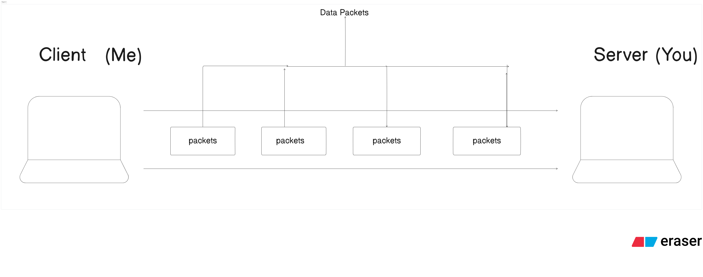

# About Networking and Internet

## About Network

Computer Networking refers to the interconnection between the different types of computing devices that exchange data and resources with each other.
So basically The deices which are connected with other devices through wires or wireless that create **Network**.

## About Internet

So The Large group / connection of networks / global Networks that is **Internet**.
In Internet Whole World Computers are connected with each other and exchange data and resources files.

- it is called networks of network .
- the wires which are kept inside oceans and seas , that is internet which connected whole world computers .

## Uses of Internet

- Learning
- Banking
- Email Sending and receiving
- Chatting
- playing games
- Streaming Videos and many more
  We cannot think today's world without Internet . It is basic needs of people nowadays.

### How Devices are Connected on Internet ?

The devices are connected through wires and cables .
Computers + Wires + protocols = Internet.

#### Some terms:

- sender : the sender is called **client** who sends request like get, post, put, delete..
- receiver : the receiver is called **server** who sends response of the request by client...
- data : the data is send between them which is named as **Payload**
- Address : the devices has given address which is connected on internet which is called **IP**.
- large data are converted into small pieces of data called **packets**.

### Bandwidth

- The maximum amount of data that can be sent per second over network connection called **bandwidth**.
- it is measure in bits per second like mbps , gbps ...

### Water Pipe Analogy :

pipe Width : Bandwidth
water : data
How much water reaches you : download speed

- Thick Pipe = more water per second
- thin Pipe = less water per second

- Bandwidth is about capacity not about speed
  for example : 1. big truck on highway (high bandwidth) 2. motorcycle in empty road (less bandwidth less latency )

### Latency (time delay)

- measured in ms.
  apply in
- online games .
- video calls

### Download and Upload Bandwidth

- Download Bandwidth : using in watching videos, browsing websites ..
- upload Bandwidth : sending files, uploading photos and videos

### Why developer care about Bandwidth ?

- compress images
- reduce data size
- use caching
- send only needed data

otherwise :

- slow website
- bad experience
- high cost of sever

Examples:
Sending 5MB image vs optimized 200KB image = BIG difference.

### Bandwidth vs Throughput

- Bandwidth: maximum possible capacity of data flow per second
- Throughput: actual data received

### some terms:

- congestion : Too many users -> traffic jam -> slow net
- Throttling :intentionally slowing down your internet speed by the network provider or server.
- jitter :unstable delay eg: bad video calls.
- packet loss : some packets might lost so TCP needs to send request which makes slower the website.

### 3 Things required for Internet

1. computers
2. wires
3. protocol (rules)

Internet is networks of network .

- your home wifi : small network
- your ISP : big network
- Countries have giant network
- All are connected with high speed cables and network

### Resource:

[Blog URL](https://dipeshchaudhary.hashnode.dev/networking-and-internet?showSharer=true)
